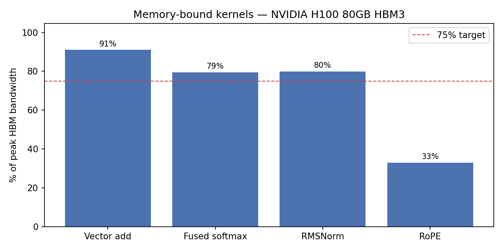
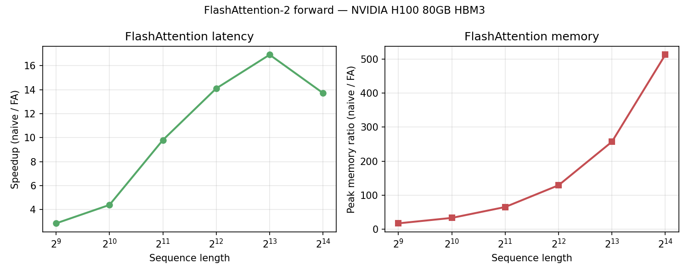
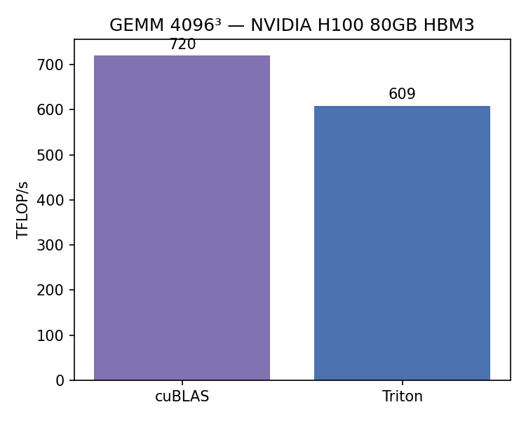

# Triton Kernels for LLM Inference

Triton implementations for transformer inference workloads: vector add, tiled GEMM, fused softmax, RMSNorm, RoPE, and FlashAttention-2 forward.

One file per kernel. Each includes a PyTorch baseline, Triton kernel, tests, and benchmarks. Bandwidth-bound ops report % of peak HBM; GEMM reports TFLOP/s vs cuBLAS.

```
01_vector_add.py       PID mapping, masking, autotune
02_matmul.py           Tiled GEMM, grouped program IDs
03_fused_softmax.py    Fused softmax (5 PyTorch ops -> 1 kernel)
04_online_softmax.py   Two-pass online softmax
05_layer_norm.py       Fused RMSNorm
06_rope_embeddings.py  Fused RoPE
07_flash_attention.py  FlashAttention-2 forward (backward: Python reference)
```

```bash
pip install -r requirements.txt
python benchmarks/run_all.py
python benchmarks/plot_results.py
```

---

## Results

H100 80GB HBM3, June 2026. Full sweep in `benchmarks/results/latest.json`.

| Kernel | Metric | Measured | GPU | Date |
|--------|--------|----------|-----|------|
| Fused softmax | % peak HBM | 79.4% | H100 80GB | 2026-06 |
| RMSNorm | % peak HBM | 79.9% | H100 80GB | 2026-06 |
| RoPE | % peak HBM | 32.9% | H100 80GB | 2026-06 |
| GEMM 4096³ | % of cuBLAS | 85% | H100 80GB | 2026-06 |
| FlashAttention | speedup @ S=8192 | 16.9× | H100 80GB | 2026-06 |
| FlashAttention | memory ratio @ S=8192 | 257× | H100 80GB | 2026-06 |

| S | Naive (ms) | FA (ms) | Speedup | Mem ratio |
|---|------------|---------|---------|-----------|
| 512 | 0.043 | 0.015 | 2.9× | 17× |
| 1024 | 0.091 | 0.021 | 4.4× | 33× |
| 2048 | 0.381 | 0.039 | 9.8× | 65× |
| 4096 | 1.523 | 0.108 | 14.1× | 129× |
| 8192 | 6.465 | 0.382 | 16.9× | 257× |
| 16384 | 20.868 | 1.521 | 13.7× | 513× |





---

## Future scope

- Triton backward for FlashAttention
- Fused attention + RMSNorm epilogue
- Nsight Compute profiling per kernel
- INT8 / FP8 quantized GEMM
